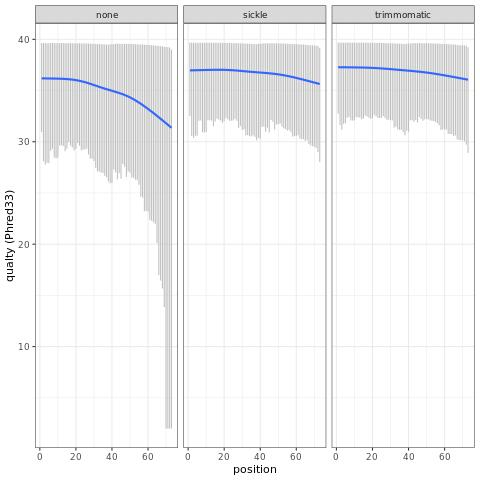
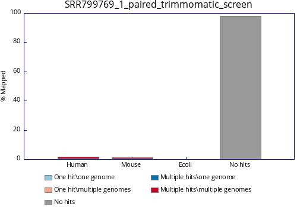

# Rerun de novo RNA-Seq assembly
## Initiative
This project is to reproduce the results of brown trout RNA-Seq published by Uren Webster et al. in 2013.

Publication:
Uren Webster, T. M., Bury, N., van Aerle, R., & Santos, E. M. (2013). Global transcriptome profiling reveals molecular mechanisms of metal tolerance in a chronically exposed wild population of brown trout. Environmental science & technology, 47(15), 8869–8877. https://doi.org/10.1021/es401380p  

##  Data source
GSE45637 dataset downloaded from GEO website:
https://www.ncbi.nlm.nih.gov/geo/query/acc.cgi?acc=GSE45637

Steps to download raw reads were documented [here](notebooks/obtain_raw_reads_from_GEO.md).

## Analysis outline
- [x] Remove adapter sequences (Base on FASTQC reports, no adapter contamination was found)  
- [x] Filter out sequences that did not meet the quality threshold  
- [x] Remove seuqences less than 35 bp  
- [ ] Pool paried reads of the adult tissues and embryo  
- [ ] De novo assemble using Velvet (version 1.2.08) and Oases by kmers  
- [ ] Annotate transcripts using Blastn and Blastx and fish and mammalian nt and protein databases with a cut off e-value < 1E-15.  
- [ ] Analyse gene expression using RSEM with `--no_polyA` parameter and default settings.  
- [ ] Statistical analysis differential expression using edgeR with a cutoff FDR <0.1.  
- [ ] Draw differential expressed genes using VennDiagram in R, Bioconductor.  

##  Analysis
-   Metadata analysis: [[Link](notebooks/metadata_analysis.ipynb)]
-   FASTQC reports for raw reads:  
SRR799769_1: [[Link](https://htmlpreview.github.io/?https://github.com/ericjuo/salmo_trutta_rna_seq/blob/master/data/02_intermediate/SRR799769_1_fastqc.html)]  
SRR799769_2: [[Link](https://htmlpreview.github.io/?https://github.com/ericjuo/salmo_trutta_rna_seq/blob/master/data/02_intermediate/SRR799769_2_fastqc.html)]  
SRR799770_1: [[Link](https://htmlpreview.github.io/?https://github.com/ericjuo/salmo_trutta_rna_seq/blob/master/data/02_intermediate/SRR799770_1_fastqc.html)]  
SRR799770_2: [[Link](https://htmlpreview.github.io/?https://github.com/ericjuo/salmo_trutta_rna_seq/blob/master/data/02_intermediate/SRR799770_2_fastqc.html)]  
SRR799771_1: [[Link](https://htmlpreview.github.io/?https://github.com/ericjuo/salmo_trutta_rna_seq/blob/master/data/02_intermediate/SRR799771_1_fastqc.html)]  
SRR799771_2: [[Link](https://htmlpreview.github.io/?https://github.com/ericjuo/salmo_trutta_rna_seq/blob/master/data/02_intermediate/SRR799771_2_fastqc.html)]  
SRR799772_1: [[Link](https://htmlpreview.github.io/?https://github.com/ericjuo/salmo_trutta_rna_seq/blob/master/data/02_intermediate/SRR799772_1_fastqc.html)]  
SRR799772_2: [[Link](https://htmlpreview.github.io/?https://github.com/ericjuo/salmo_trutta_rna_seq/blob/master/data/02_intermediate/SRR799772_2_fastqc.html)]  
SRR799773_1: [[Link](https://htmlpreview.github.io/?https://github.com/ericjuo/salmo_trutta_rna_seq/blob/master/data/02_intermediate/SRR799773_1_fastqc.html)]  
SRR799773_2: [[Link](https://htmlpreview.github.io/?https://github.com/ericjuo/salmo_trutta_rna_seq/blob/master/data/02_intermediate/SRR799773_2_fastqc.html)]  
SRR799774_1: [[Link](https://htmlpreview.github.io/?https://github.com/ericjuo/salmo_trutta_rna_seq/blob/master/data/02_intermediate/SRR799774_1_fastqc.html)]  
SRR799774_2: [[Link](https://htmlpreview.github.io/?https://github.com/ericjuo/salmo_trutta_rna_seq/blob/master/data/02_intermediate/SRR799774_2_fastqc.html)]  
SRR799775_1: [[Link](https://htmlpreview.github.io/?https://github.com/ericjuo/salmo_trutta_rna_seq/blob/master/data/02_intermediate/SRR799775_1_fastqc.html)]  
SRR799775_2: [[Link](https://htmlpreview.github.io/?https://github.com/ericjuo/salmo_trutta_rna_seq/blob/master/data/02_intermediate/SRR799775_2_fastqc.html)]  
SRR799776_1: [[Link](https://htmlpreview.github.io/?https://github.com/ericjuo/salmo_trutta_rna_seq/blob/master/data/02_intermediate/SRR799776_1_fastqc.html)]  
SRR799776_2: [[Link](https://htmlpreview.github.io/?https://github.com/ericjuo/salmo_trutta_rna_seq/blob/master/data/02_intermediate/SRR799776_2_fastqc.html)]  
-   According to the [Hansen's article](https://academic.oup.com/nar/article/38/12/e131/2409775), biased nucleic acid content is common for RNA-Seq dataset as it is stemmed from hexamer priming or fragmentation using transposases. But these bised sequences do not affect downstream analysis like de novo assembly or mapping to reference genome. So I will not trim the first 12 bases of the reads as stated in the Uren Webster's article.
- Quality trimming using Trimmomatic  
SRR799770_1_paired_trimmomatic: [[Link](https://htmlpreview.github.io/?https://github.com/ericjuo/salmo_trutta_rna_seq/blob/master/data/02_intermediate/SRR799770_1_paired_trimmomatic_fastqc.html)]

- Quality trimming using sickle  
SRR799770_1_sickle: [[Link](https://htmlpreview.github.io/?https://github.com/ericjuo/salmo_trutta_rna_seq/blob/master/data/02_intermediate/SRR799770_1_sickle_fastqc.html)]

- Before vs. After trimming  

- MultiQC report: [[Link](https://htmlpreview.github.io/?https://github.com/ericjuo/salmo_trutta_rna_seq/blob/master/data/02_intermediate/multiqc_report_1.html)]

- Fasq_screen analysis showed that reads were contaminated with mammalian genome

