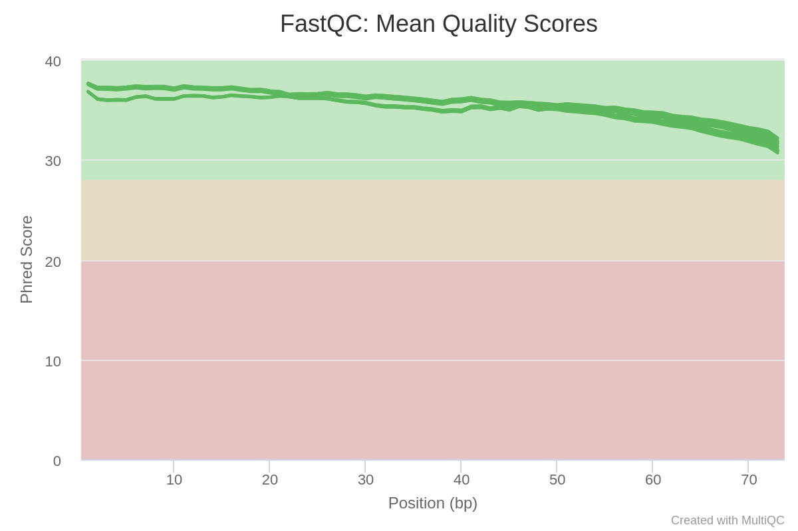
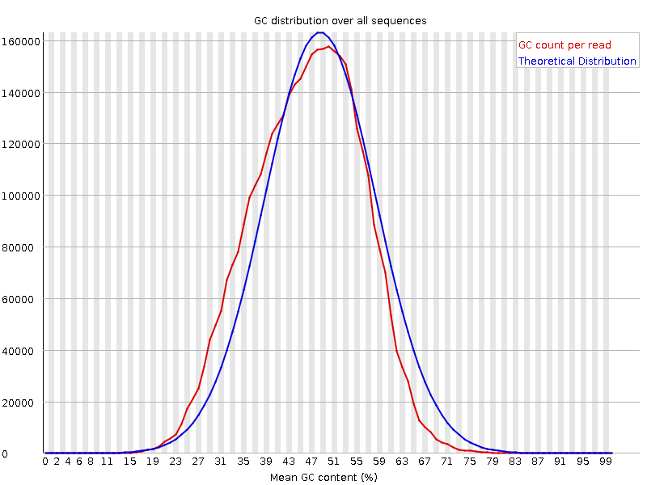
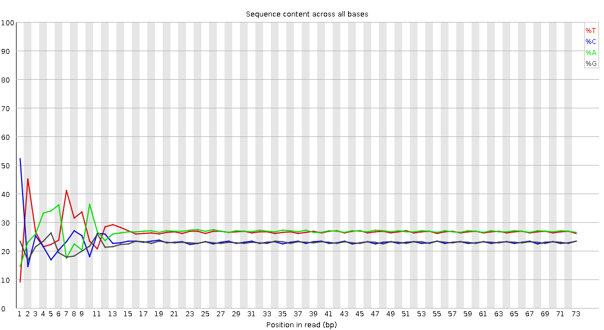
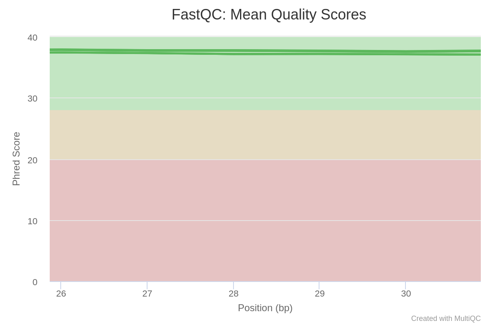
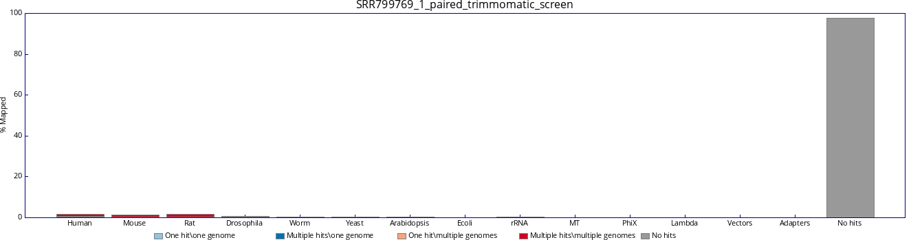
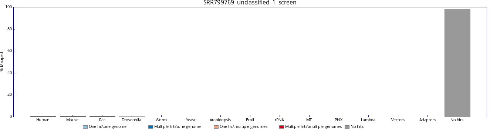
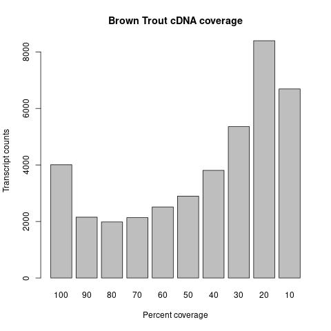

# Reproduce RNA-Seq analysis in the Uren Webster's paper
## Initiative
This project is to reproduce the results of brown trout RNA-Seq analysis published by Uren Webster et al. in 2013. I aim to learn the technique of RNA-Seq analysis by reproducing them again.

Publication:
Uren Webster, T. M., Bury, N., van Aerle, R., & Santos, E. M. (2013). Global transcriptome profiling reveals molecular mechanisms of metal tolerance in a chronically exposed wild population of brown trout. Environmental science & technology, 47(15), 8869–8877. https://doi.org/10.1021/es401380p  


##  Data source
GSE45637 is the associated dataset to the paper. It can be downloaded from GEO website:
https://www.ncbi.nlm.nih.gov/geo/query/acc.cgi?acc=GSE45637

Steps to download the whole dataset: [[Link](notebooks/obtain_raw_reads_from_GEO.md)].

## Analysis outline
- [x] Remove adapter sequences  
- [x] Trim bases which the Pred quality score is below 20
- [x] Remove reads less than 35 bp  
- [x] Remove foreign species contaminants
- [x] De novo assemble using Trinity
- [ ] Post assemble quality control 
- [ ] Annotate transcripts using Blastn and Blastx and fish and mammalian nt and protein databases with a cut off e-value < 1E-15.  
- [ ] Analyse gene expression using RSEM with `--no_polyA` parameter and default settings.  
- [ ] Statistical analysis differential expression using edgeR with a cutoff FDR <0.1.  
- [ ] Draw differential expressed genes using VennDiagram in R, Bioconductor.  

## Pipline
All analysis has been written into a snakemake pipeline. If you wish to reproduce theses analysis as I did, you can clone this git repository.  
```
$ git clone git@github.com:ericjuo/salmo_trutta_rna_seq.git
```  
Setup conda environment to run softwares used in the pipeline.
```
$ mamba env create -f requirements.yaml
```  
Download raw reads from GEO website.
```
prefetch --option-file data/01_raw/SRR_Acc_List.txt -O data/01_raw
```

Download databases for Trimmomatic, fastqc_screen and kraken2 tools. 
```
$ mkdir -p contaminants/adapters/
$ wget -O contaminants/adapters/TruSeq2-PE.fa \ 
https://github.com/timflutre/trimmomatic/blob/master/adapters/TruSeq2-PE.fa
$ fastq_screen --get_genomes --outdir contaminants/
$ wget -O contaminants/minikraken2.tgz \ 
ftp://ftp.ccb.jhu.edu/pub/data/kraken2_dbs/old/minikraken2_v2_8GB_201904.tgz
$ cd contaminants
$ tar -xzvf minikraken2.tgz
$ cd ..
```  
Run snakemake pipeline on the fly.
```
snakemake --cores 10 --use-conda 
```

##  Analysis
-   The matadata analysis show that there are 2 sample groups (fish group from control River Teign and high metal content River Hayle ). For each group, there are RNA-Seq of gill, stomach and intestine, trunk kidney and liver tissues.  
Steps to perform metadata analysis: [[Link](notebooks/metadata_analysis.ipynb)]  

    |    | Run       |       Gb | tissue                | treatment              |
    |---:|:----------|---------:|:----------------------|:-----------------------|
    |  0 | SRR799769 | 0.255852 | gill                  | chronic metal exposure |
    |  1 | SRR799770 | 0.280547 | stomach and intestine | chronic metal exposure |
    |  2 | SRR799771 | 0.312282 | trunk kidney          | chronic metal exposure |
    |  3 | SRR799772 | 0.321309 | liver                 | chronic metal exposure |
    |  4 | SRR799773 | 0.305214 | gill                  | control                |
    |  5 | SRR799774 | 0.299001 | stomach and intestine | control                |
    |  6 | SRR799775 | 0.272784 | trunk kidney          | control                |
    |  7 | SRR799776 | 0.338982 | liver                 | control                |  


-   The initial qualtiy of these raw reads were inspected using FastQC and MultiQC software.  
    Initial QC report: [[Link](https://htmlpreview.github.io/?https://github.com/ericjuo/salmo_trutta_rna_seq/blob/master/report/initial_multiqc/raw_read_multiqc_report.html)]
    
    

- Shift in GC content peak indicates potential contamination with other speices.  
  

-   Biased nucleotide content at 5'end of reads is commonly seen in RNA-Seq dataset, which is stemmed from priming on fragmented RNA with hexamer or fragmentation with transposases ([Hansen et al., 2010](https://academic.oup.com/nar/article/38/12/e131/2409775)). But it doesn't affect the downstream de novo asseblmly.  


- Raw reads were subjected to quality trimming using trimmomatic. The leading and trailing 3 bases of reads were trimmed. Those bases with phred scores below 20 were trimmed, and those read length shorter than 35 bp after trimming were discarded. In addition, the remaining illumina adapter were also removed.    
Quality report of trimmomatic-trimmed reads from FastQC software: [[Link](https://htmlpreview.github.io/?https://github.com/ericjuo/salmo_trutta_rna_seq/blob/master/data/02_intermediate/SRR799770_1_paired_trimmomatic_fastqc.html)]  
Steps to perform trimmomatic: [[Link](./notebooks/quality_trimming_using_trimmomatic.md)]

- Quality of reads after trimming were summarized in multiqc report. Low quality bases at 3'end has been completely trimmed off: [[Link](https://htmlpreview.github.io/?https://github.com/ericjuo/salmo_trutta_rna_seq/blob/master/report/post_trim_multiqc/trimmomatic_trim_multiqc_report.html)]  


- Trommatic-trimmed reads were searched against human, mouse and E. Coli genome using Fastq Screen to identify foreign species contaminants. The result showed that the read set contains some mammalian contaminants.  
  

- Foreign species contamination were removed by Kraken2 software, leaving >98% reads unclassifed. These unclassified reads are our brown trout reads.    
  

- After reads clean up, forward and reverse reads were separately pooled together and inputed to Trinity for de novo assembling. The resultant is 151,611 transcripts, which is very close to the number of brown trout's annotated transcripts (122,381) reported on ensembl. 
Link to brown trout genome statistic: [[Link](https://asia.ensembl.org/Salmo_trutta/Info/Annotation)]  

- Basic statisic was performed using trinity's perl script. Trinity has reconstructed 151,611 transcripts and predicted these transcripts were transcribed from 99,890 genes. The N50 of transcripts are 1,390 bp. The average length of transcripts is 830.04 bp.

- The representation of assembled transcripts to input reads were calculated using bowtie2. The report showed that 89.91% paired reads can be realigned to the assembled transcripts, indicating good asseble quality.  
```
23453284 reads; of these:
  23453284 (100.00%) were paired; of these:
    3880194 (16.54%) aligned concordantly 0 times
    4959861 (21.15%) aligned concordantly exactly 1 time
    14613229 (62.31%) aligned concordantly >1 times
    ----
    3880194 pairs aligned concordantly 0 times; of these:
      161179 (4.15%) aligned discordantly 1 time
    ----
    3719015 pairs aligned 0 times concordantly or discordantly; of these:
      7438030 mates make up the pairs; of these:
        4731395 (63.61%) aligned 0 times
        869484 (11.69%) aligned exactly 1 time
        1837151 (24.70%) aligned >1 times
89.91% overall alignment rate
```

- Assembled transcripts were blasted against ensembl's brown trout cDNA database using blastn. The result showed that about 4,000 transcripts were reconstructed in full length, and about 12,800 transcripts have at least 50% coverage to brown trout cDNA.  


